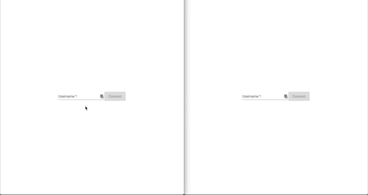
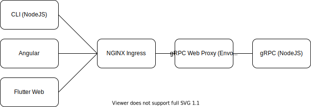

# gRPC Web with NodeJS(TypeScript) and Flutter

This repo is an example of the server side streaming using gRPC-WEB, Flutter-Web and NodeJS.
Due to the browser limitation, the bidrectional streaming is not possible but the server side streaming.

  

  

